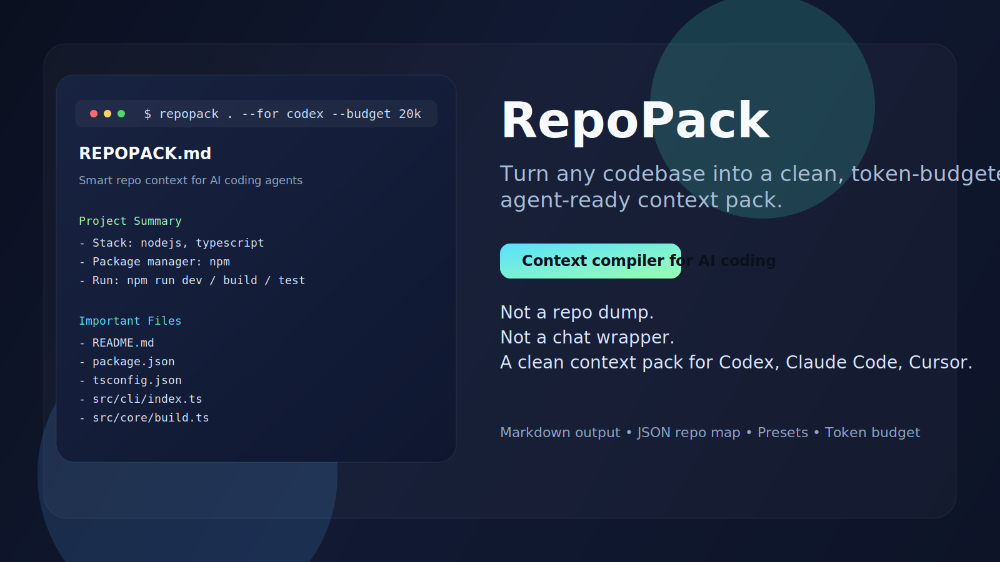

<div align="center">



<br />

# 📦 RepoPack

### The Context Compiler for AI Coding Workflows

*Turn any codebase into a clean, token-budgeted, agent-ready context pack.*

*把任意代码仓库编译成干净、限预算、可直接给 AI 编程代理使用的上下文包。*

<br />

[](https://github.com/Nigmat-future/repopack/actions/workflows/ci.yml)
[](https://github.com/Nigmat-future/repopack/blob/main/LICENSE)
[](https://github.com/Nigmat-future/repopack)
[](https://nodejs.org/)
[](https://www.typescriptlang.org/)
[](https://github.com/Nigmat-future/repopack/releases)

<br />

**[Quickstart](#-quickstart)** · **[Features](#-features)** · **[Usage](#-usage)** · **[Output](#-output-model)** · **[Roadmap](#-roadmap)**

<br />

</div>

---

## 🧠 What is RepoPack?

> **RepoPack is not a repo dump. It's a context compiler.**

Most "repo-to-markdown" tools blindly export everything. RepoPack takes a fundamentally different approach — it **scans**, **filters**, **ranks**, and **compiles** your codebase into the smallest, highest-signal context bundle an AI agent needs to work effectively.

大多数 "repo 转 markdown" 工具只是盲目导出。RepoPack 从根本上采用不同的方法——它会**扫描**、**过滤**、**排序**并**编译**你的代码库，生成 AI 代理高效工作所需的最小、最高信号的上下文包。

<br />

<div align="center">

```
┌─────────────┐      ┌──────────────┐      ┌──────────────┐      ┌──────────────────┐
│  Your Repo  │ ───▶ │  Scan &      │ ───▶ │  Rank &      │ ───▶ │  📄 REPOPACK.md  │
│  (any size) │      │  Filter      │      │  Budget      │      │  📊 repo-map.json │
└─────────────┘      └──────────────┘      └──────────────┘      └──────────────────┘
                      .gitignore-aware       Token-budgeted        Agent-ready output
                      Noise removal          Signal ranking         Structured & clean
```

</div>

<br />

## ⚡ Quickstart

Get up and running in **30 seconds**:

```bash
# 1. Install dependencies
npm install

# 2. Build the project
npm run build

# 3. Pack your repo!
node dist/cli/index.js . --for codex --budget 20k
```

<details>
<summary><b>📋 Example Output</b></summary>

<br />

```
RepoPack complete for D:\repo
Scanned 128 files
Selected 14 files
Estimated tokens 6031/20000
Wrote D:\repo\REPOPACK.md and D:\repo\repo-map.json
```

</details>

**Generated artifacts:**

| File | Purpose |
|:-----|:--------|
| `REPOPACK.md` | Structured context for AI agents & humans |
| `repo-map.json` | Machine-readable map for automation & pipelines |

<br />

## 🎯 Why RepoPack?

RepoPack is designed around one practical question:

> *What is the **smallest, cleanest, highest-signal** context I can hand to an AI agent so it works on my repo without wasting tokens?*

<br />

<table>
<tr>
<td width="50%">

### ❌ Without RepoPack

- 🔍 Manual file picking
- 💥 Low-value files bloat context
- 🪦 Entry points get buried
- 🔄 Rebuild context for every model switch

</td>
<td width="50%">

### ✅ With RepoPack

- 🤖 Automatic scan & intelligent filtering
- 📈 High-signal files rise to the top
- 🎯 Entrypoints, config & docs surfaced
- ♻️ Reuse across Codex, Claude, Cursor & more

</td>
</tr>
</table>

<br />

### 💡 Four Core Principles

<table>
<tr>
<td align="center" width="25%">
<h3>🔍</h3>
<b>Find Signal</b><br/>
<sub>Don't dump everything.<br/>Extract what matters.</sub>
</td>
<td align="center" width="25%">
<h3>📏</h3>
<b>Fit Budget</b><br/>
<sub>Real token limits.<br/>Real LLM constraints.</sub>
</td>
<td align="center" width="25%">
<h3>🤖</h3>
<b>Agent-First</b><br/>
<sub>Structure for machines,<br/>readable by humans.</sub>
</td>
<td align="center" width="25%">
<h3>🔗</h3>
<b>Dual Output</b><br/>
<sub>Markdown + JSON =<br/>reusable infrastructure.</sub>
</td>
</tr>
</table>

<br />

## ✨ Features

<table>
<tr>
<td>🧹</td><td><b>Smart File Selection</b></td><td>Intelligent scanning instead of full repository dumps</td>
</tr>
<tr>
<td>📊</td><td><b>Token-Budgeted</b></td><td>Output sized to fit real LLM context windows (<code>8k</code>, <code>20k</code>, <code>50k</code>)</td>
</tr>
<tr>
<td>🎛️</td><td><b>Workflow Presets</b></td><td>Built-in presets for <code>codex</code>, <code>claude</code>, <code>cursor</code>, and <code>generic</code></td>
</tr>
<tr>
<td>🚫</td><td><b>.gitignore Aware</b></td><td>Automatically respects your repository's ignore patterns</td>
</tr>
<tr>
<td>📄</td><td><b>Markdown Output</b></td><td>Structured context for direct prompt and agent consumption</td>
</tr>
<tr>
<td>📊</td><td><b>JSON Repo Map</b></td><td>Machine-readable output for automation, pipelines & tooling</td>
</tr>
<tr>
<td>⚖️</td><td><b>Signal Ranking</b></td><td>Rule-based ranking tuned toward docs, config & entry paths</td>
</tr>
</table>

<br />

## 🛠️ Usage

```bash
repopack [target] [options]
```

### Examples

```bash
# Pack current repo for Codex with 20k token budget
repopack . --for codex --budget 20k

# Pack a legacy service for Claude with larger budget
repopack ../legacy-service --for claude --budget 50k

# Custom include/exclude patterns
repopack . --include "src/**" --exclude "tests/**"
```

### Options Reference

| Option | Description | Example |
|:-------|:-----------|:--------|
| `--budget <value>` | Token budget | `8k`, `20k`, `50000` |
| `--for <preset>` | Workflow preset | `codex`, `claude`, `cursor`, `generic` |
| `--output <file>` | Markdown output path | `REPOPACK.md` |
| `--json <file>` | JSON output path | `repo-map.json` |
| `--stdout` | Print Markdown to stdout | — |
| `--include <glob>` | Extra include pattern | `"src/**"` |
| `--exclude <glob>` | Extra exclude pattern | `"tests/**"` |

<br />

## 📦 Output Model

<details open>
<summary><h3>📄 <code>REPOPACK.md</code> — Human & Agent Readable</h3></summary>

Structured for direct AI consumption:

- 📋 **Project summary** — stack, package manager, description
- 🌳 **Repository tree** — filtered directory structure
- ▶️ **Run commands** — dev, build, test, lint
- ⚙️ **Important config** — detected configuration files
- 🎯 **Key entry points** — main files and CLI entry
- 📂 **Source directories** — key source paths
- 🏗️ **Architecture notes** — high-level structure
- 📑 **Important files** — with rationale and preview
- ✂️ **Selected snippets** — critical code sections
- ⚠️ **Caveats** — known limitations

</details>

<details>
<summary><h3>📊 <code>repo-map.json</code> — Machine Readable</h3></summary>

Structured for automation and tooling:

- 🔧 Stack detection
- 📦 Package manager detection
- ▶️ Run commands
- 🎯 Entry points
- 📂 Source directories
- 📑 Important files with scores
- 📊 Budget metadata
- ⚠️ Caveats

</details>

<br />

## 🔬 Scope & Philosophy

> **RepoPack v0.1 is intentionally narrow.**

It does **not** try to be a chat interface, RAG platform, vector database, or full repo intelligence system.

It does **one thing well**: compile a repository into a cleaner context pack for AI coding workflows.

> **RepoPack v0.1 刻意保持边界清晰。**
> 它不做聊天界面、不做 RAG 平台、不做向量数据库，也不试图变成一个大而全的仓库智能系统。
> 它只做一件事：把代码仓库编译成更适合 AI 编程工作流消费的上下文包。

<br />

## 🧑‍💻 Development

```bash
# Install dependencies
npm install

# Type-check
npm run check

# Build
npm run build

# Run tests
npm run test
```

<br />

## 🗺️ Roadmap

| Status | Feature |
|:------:|:--------|
| 🔲 | Better framework & monorepo detection |
| 🔲 | Stronger entry-point & dependency inference |
| 🔲 | GitHub URL input (remote repos) |
| 🔲 | `issue2context` subcommand |
| 🔲 | Incremental project memory mode |
| 🔲 | MCP server mode |

<br />

## 🤝 Contributing

Contributions are welcome! Whether it's bug reports, feature requests, or pull requests — every contribution helps make RepoPack better.

1. **Fork** the repository
2. **Create** your feature branch (`git checkout -b feature/amazing-feature`)
3. **Commit** your changes (`git commit -m 'Add amazing feature'`)
4. **Push** to the branch (`git push origin feature/amazing-feature`)
5. **Open** a Pull Request

<br />

## 📄 License

This project is licensed under the **MIT License** — see the [LICENSE](LICENSE) file for details.

<br />

---

<div align="center">

**Made with ❤️ for the AI-native developer workflow**

<sub>If RepoPack helped you, consider giving it a ⭐</sub>

<br />

[⬆ Back to Top](#-repopack)

</div>
